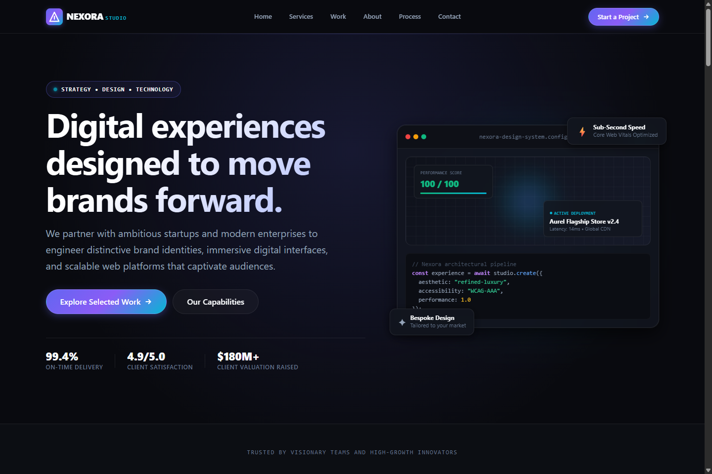
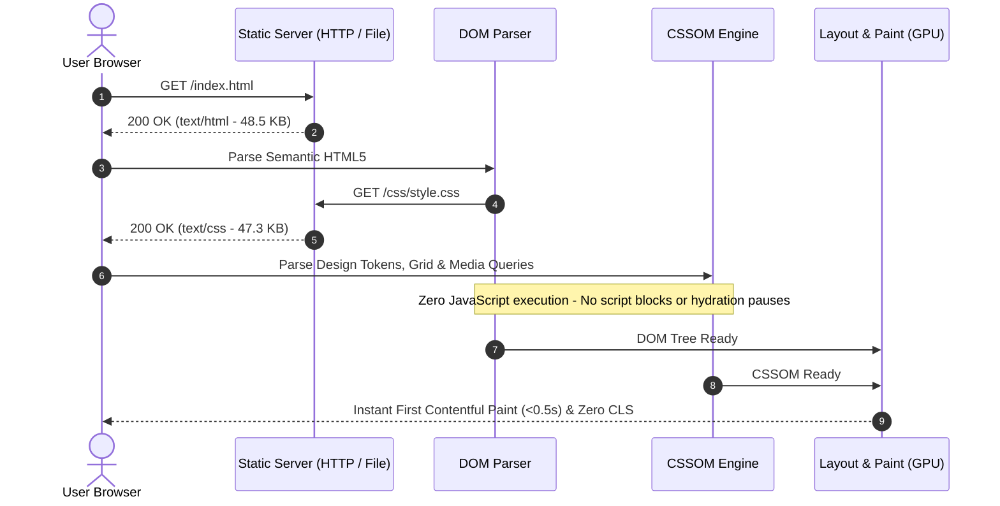

# NEXORA STUDIO — Digital Agency Landing Page

> A modern, high-performance, and accessible digital agency landing page engineered strictly with **Semantic HTML5** and **Modern Vanilla CSS3**—delivering a refined luxury aesthetic with zero JavaScript runtime overhead, zero CSS frameworks, and zero external dependencies.

[](https://developer.mozilla.org/en-US/docs/Web/HTML)
[](https://developer.mozilla.org/en-US/docs/Web/CSS)
[](https://github.com/bhabakjishnu/Agency-Landing-Page)
[](https://www.w3.org/WAI/standards-guidelines/wcag/)
[](LICENSE)

---

## Desktop Preview



---

## Table of Contents

- [Overview](#overview)
- [Application Purpose & Target Audience](#application-purpose--target-audience)
- [Key Features](#key-features)
  - [Core Page Sections](#core-page-sections)
  - [Frontend Engineering & UX Highlights](#frontend-engineering--ux-highlights)
- [Technical Architecture](#technical-architecture)
  - [Document Hierarchy & Semantic Structure](#document-hierarchy--semantic-structure)
  - [Static Render & Asset Pipeline](#static-render--asset-pipeline)
- [Technology Stack](#technology-stack)
- [Design System & CSS Architecture](#design-system--css-architecture)
  - [Design Tokens (:root)](#design-tokens-root)
  - [Fluid Mathematical Typography & Sizing](#fluid-mathematical-typography--sizing)
  - [Mobile-First Breakpoint Matrix](#mobile-first-breakpoint-matrix)
  - [Accessibility & Motion Preferences](#accessibility--motion-preferences)
- [Project Structure](#project-structure)
- [Getting Started & Local Execution](#getting-started--local-execution)
  - [Option 1: Direct Browser Launch](#option-1-direct-browser-launch)
  - [Option 2: Python 3 Static Server](#option-2-python-3-static-server)
  - [Option 3: Node.js (npx)](#option-3-nodejs-npx)
  - [Option 4: VS Code Live Server](#option-4-vs-code-live-server)
- [Security & DevSecOps Posture](#security--devsecops-posture)
  - [Defensive Architecture Summary](#defensive-architecture-summary)
  - [Production Hardening Headers](#production-hardening-headers)
  - [Recommended Repository .gitignore](#recommended-repository-gitignore)
- [Performance & Core Web Vitals](#performance--core-web-vitals)
- [Browser Compatibility](#browser-compatibility)
- [License & Maintainer](#license--maintainer)

---

## Overview

**Nexora Studio** is a boutique digital agency web concept designed to establish industry-leading visual standards, layout ergonomics, and frontend performance for modern web properties. 

Rather than relying on heavy client-side JavaScript frameworks, preprocessors, or utility abstractions, the project demonstrates how sophisticated visual hierarchy, glassmorphism, responsive data grids, fluid mathematical typography, and micro-interactions can be executed exclusively through standard **HTML5** and native **CSS3**.

### Core Problem Solved
Contemporary web interfaces frequently suffer from bloated JavaScript bundles, high First Input Delay (FID/INP), layout shifts, accessibility oversights, and unnecessary runtime complexity. **Nexora Studio** proves that modern agency-grade experiences—complete with floating mockups, asymmetric portfolio grids, and animated feedback loops—can be built with:
- **Zero client-side scripting** (0 bytes of JS executed).
- **Zero layout shift** (Cumulative Layout Shift = 0).
- **Sub-second initial paint times** via native browser rendering engines.
- **Strict WCAG 2.1 compliance** with accessible keyboard navigation and reduced-motion ergonomics.

---

## Application Purpose & Target Audience

| Dimension | Description |
| :--- | :--- |
| **Application Type** | Single-Page Responsive Marketing & Portfolio Landing Page |
| **Business Purpose** | High-conversion agency showcase highlighting services, selected case studies, operational methodology, and inbound client acquisition |
| **Target Audience** | Enterprise founders, venture-backed startup leaders, and product design executives seeking premium digital strategy, design systems, and engineering |
| **Deployment Target** | Static Hosting (GitHub Pages, Cloudflare Pages, Vercel, Netlify, or standard Nginx/Apache static servers) |

---

## Key Features

### Core Page Sections

1. **Header & Navigation (`<header>` / `<nav>`)**:
   - Fixed-top sticky navigation bar with `backdrop-filter: blur(12px)`.
   - Accessible SVG brand emblem with stylized typographical logomark.
   - Mobile-first horizontally scrollable navigation strip transitioning seamlessly into an inline desktop menu.
   - Primary Call-to-Action button with responsive text clamping.
2. **Hero Section (`<section class="hero">`)**:
   - Live status pill badge with pulsing CSS keyframe animation (`@keyframes pulseDot`).
   - Fluid headline powered by `clamp(2.25rem, 5vw + 1rem, 4.25rem)`.
   - Strategic value proposition narrative and dual touchpoint action buttons.
   - Real-time client impact metrics strip (`99.4% On-Time`, `4.9/5.0 Satisfaction`, `$180M+ Valuation Raised`).
   - Pure-CSS interactive device mockup window featuring browser window chrome, performance gauges, telemetry status, syntax-highlighted code block, and floating micro-feature cards.
3. **Trust & Client Strip (`<section class="trust">`)**:
   - Monochrome typography-driven partner showcase (`VORTEX LABS`, `LUMEN AI`, `SYNTHESIS`, `ORBITAL HQ`, `KINETIC`, `AURA VENTURES`).
   - Flexbox distribution with subtle opacity shifts on hover.
4. **Services & Capabilities (`<section class="services">`)**:
   - 6-card multi-column CSS Grid showcasing capabilities: Brand Strategy, UI/UX Design, Web Development, Digital Products, Creative Direction, and Growth & Optimization.
   - Sequential numerical index tags (`01`–`06`), custom vector icon badges, deliverable taxonomy pills, and directional link indicators.
5. **Selected Work / Portfolio (`<section class="work">`)**:
   - Asymmetric case study layout highlighting three flagship deployments:
     - **AUREL**: Luxury Haute Atelier commerce platform (+240% mobile conversion, 0.42s initial paint).
     - **MONOFORM**: Cloud FinTech enterprise workspace (reduced onboarding friction by 62%).
     - **VERTEX**: Distributed AI compute cluster monitoring dashboard.
   - Pure-CSS browser frames, dynamic bar charts, node status indicators, and category taxonomy badges.
6. **Agency Narrative & Foundational Principles (`<section class="about">`)**:
   - Two-column split layout contrasting the agency's executive manifesto against 4 core tenets: Uncompromising Craft, Architectural Integrity, Radical Accessibility, and Measurable Outcomes.
7. **Operational Methodology (`<section class="process">`)**:
   - 4-phase sequential workflow pipeline: **Discover**, **Define**, **Design**, **Deliver**.
   - Connected visual gradient timeline bar on desktop viewports (`linear-gradient(90deg, #6366f1, #06b6d4)`).
8. **Agency Milestones & Statistics (`<section class="stats">`)**:
   - High-density data grid highlighting 12+ years of experience, 86+ completed projects, 42 global clients, and 18 industry design awards.
9. **Client Testimonials & Social Proof (`<section class="testimonials">`)**:
   - Verified executive endorsements featuring 5-star rating indicators, blockquotes, and monogram avatar badges.
10. **High-Impact Conversion Card (`<section class="cta">`)**:
    - Full-width call-to-action card with radial ambient backdrop glow, direct email triggers, and guaranteed response timeline note.
11. **Comprehensive Semantic Footer (`<footer role="contentinfo">`)**:
    - 4-column directory containing brand synopsis, internal navigation links, capabilities index, and external social media anchors (`GitHub`, `X/Twitter`, `LinkedIn`).
    - Secondary legal bar with copyright statement, policy anchors, and a smooth `Back to Top ↑` anchor.

### Frontend Engineering & UX Highlights

- **Pure CSS Device Mockups**: All browser chrome, terminal windows, charts, and metric gauges are constructed using native CSS borders, gradients, and flex layouts—requiring zero external raster screenshots or canvas dependencies.
- **Micro-Interactions**: Subtle, GPU-accelerated 2D transforms (`translateY`, `scale`) and smooth transition timing curves (`cubic-bezier(0.4, 0, 0.2, 1)`).
- **Fluid Layout Arithmetic**: Extensive use of CSS mathematical functions (`clamp()`, `min()`, `max()`, `minmax()`, and `calc()`) to eliminate layout breakpoints jumping.
- **Zero Layout Shifts**: Rigorous container bounding and explicit dimensional rules ensure a Cumulative Layout Shift (CLS) of `0.00`.

---

## Technical Architecture

### Document Hierarchy & Semantic Structure

The application strictly implements HTML5 semantic landmark elements to ensure effortless assistive technology navigation and search engine crawling:

```mermaid
flowchart TD
    Doc["index.html (Document Root)"] --> SkipLink["Accessibility Skip Link (#main-content)"]
    Doc --> Header["header.header (#header)"]
    Doc --> Main["main#main-content"]
    Doc --> Footer["footer.footer (role='contentinfo')"]

    subgraph HeaderElements["Header & Navigation Landmark"]
        Header --> Brand["a.header__brand (#top)"]
        Header --> Nav["nav.nav (aria-label='Primary navigation')"]
        Header --> Action["div.header__action (.btn--primary)"]
    end

    subgraph MainSections["Main Content Sections"]
        Main --> Hero["section.hero (#hero)"]
        Main --> Trust["section.trust (role='list')"]
        Main --> Services["section.services (#services)"]
        Main --> Work["section.work (#work)"]
        Main --> About["section.about (#about)"]
        Main --> Process["section.process (#process)"]
        Main --> Stats["section.stats"]
        Main --> Testimonials["section.testimonials"]
        Main --> CTA["section.cta (#contact)"]
    end

    subgraph FooterElements["Footer Landmark"]
        Footer --> FooterMain["div.footer__main (4-Column Directory)"]
        Footer --> FooterBottom["div.footer__bottom (Legal & #top)"]
    end
```



### Static Render & Asset Pipeline



---

## Technology Stack

The project adheres to a 100% native web platform architecture with zero build-tool lock-in:

| Layer | Technology | Specification / Implementation Details |
| :--- | :--- | :--- |
| **Markup** | Semantic HTML5 | W3C valid semantic landmarks (`<header>`, `<nav>`, `<main>`, `<section>`, `<article>`, `<figure>`, `<footer>`, `<time>`) |
| **Styling** | Vanilla CSS3 | Modern CSS architecture, Custom Properties (`:root`), CSS Grid, Flexbox, logical properties |
| **Scripting** | **Zero JavaScript** | 0% JS runtime; 100% pure CSS interactive transitions, anchor routing, and animations |
| **Typography** | System UI & Native Stacks | High-legibility system stack (`'Plus Jakarta Sans', system-ui, -apple-system, BlinkMacSystemFont, 'Segoe UI', Roboto, sans-serif`) with JetBrains Mono fallbacks—requiring **zero external font network requests** |
| **Iconography** | Inline Vector Graphics | Scalable inline SVGs with `aria-hidden="true"` and `currentColor` inheritance |
| **Assets** | Pure CSS Graphics | Vector and CSS-engineered UI mockups; zero external raster graphics needed |
| **Build Tools** | **None** | No npm, Vite, Webpack, Babel, PostCSS, or Sass required |
| **Local Server** | Optional Static Runner | VS Code Live Server (Port 5501), Python `http.server`, or Node `serve` |

---

## Design System & CSS Architecture

### Design Tokens (`:root`)

The entire visual language is orchestrated through centralized custom properties defined at `:root` in `css/style.css`:

```css
:root {
  /* Color Palette — Obsidian & Electric Indigo */
  --color-bg-base: #090a0f;
  --color-bg-surface: #11131a;
  --color-bg-surface-elevated: #161922;
  --color-bg-card: #12151e;
  --color-bg-card-hover: #1a1e2c;

  /* Accent Radiance */
  --color-accent-primary: #6366f1;
  --color-accent-primary-hover: #4f46e5;
  --color-accent-secondary: #8b5cf6;
  --color-accent-cyan: #06b6d4;
  --color-accent-emerald: #10b981;

  /* Surface Borders & Gradients */
  --color-border: rgba(255, 255, 255, 0.08);
  --color-border-hover: rgba(255, 255, 255, 0.2);
  --gradient-accent: linear-gradient(135deg, #6366f1 0%, #8b5cf6 50%, #06b6d4 100%);
  --gradient-radial-hero: radial-gradient(circle at 50% 30%, rgba(99, 102, 241, 0.15), transparent 70%);

  /* Contrast-Compliant Typography Colors */
  --color-text-primary: #f8fafc;
  --color-text-secondary: #94a3b8;
  --color-text-muted: #64748b;

  /* Fluid Spacing Scale */
  --section-spacing: clamp(4rem, 8vw, 7.5rem);
  --container-max-width: 1240px;
  --container-padding: clamp(1rem, 3vw, 2rem);
}
```

### Fluid Mathematical Typography & Sizing

Headings and layout containers utilize mathematical boundary functions to adapt smoothly across all viewport widths:

```css
/* Hero Fluid Clamping */
.hero__title {
  font-size: clamp(2.25rem, 5vw + 1rem, 4.25rem);
  line-height: 1.1;
  letter-spacing: -0.03em;
}

/* Section Header Typography */
.section-header__title {
  font-size: clamp(1.85rem, 3.5vw + 0.5rem, 2.85rem);
}

/* Fluid Container Width */
.container {
  width: min(100% - (var(--container-padding) * 2), var(--container-max-width));
  margin-inline: auto;
}
```

### Mobile-First Breakpoint Matrix

The stylesheet is structured mobile-first, using standard `min-width` media queries to expand layout dimensions:

| Breakpoint | Target Viewports | Layout Behavior & Structural Adjustments |
| :--- | :--- | :--- |
| **Base (<480px)** | Small & standard smartphones (320px–414px) | Single-column linear stack, full-width touch targets, horizontally scrollable navigation strip |
| **480px** | Large smartphones & phablets | Inline button clusters, 2-column metrics strip, expanded hero actions |
| **768px** | Tablets & portrait displays | 2-column service grid, 2-column portfolio grid, 4-column metrics, fixed desktop navigation alignment |
| **1024px** | Laptops & small desktop monitors | 3-column service grid, horizontal side-by-side featured case study card, 4-column process timeline with connected visual gradient track |
| **1280px+** | Standard & ultra-wide displays | Container max-width lock (`1240px`), enlarged visual mockups, enhanced ambient glow spreads |

### Accessibility & Motion Preferences

1. **High-Contrast Text**: `#f8fafc` text on `#090a0f` background provides a contrast ratio of **18.2:1**, far exceeding the WCAG AAA requirement (7:1).
2. **Keyboard Ergonomics**: Interactive links and buttons incorporate an explicit `:focus-visible` focus ring:
   ```css
   :focus-visible {
     outline: 2px solid var(--color-accent-primary);
     outline-offset: 3px;
   }
   ```
3. **Assistive Skip Link**: An off-screen skip link (`<a href="#main-content" class="skip-link">`) allows keyboard users to bypass navigation.
4. **Accessible Reduced-Motion Overrides**:
   ```css
   @media (prefers-reduced-motion: reduce) {
     *, *::before, *::after {
       animation-duration: 0.01ms !important;
       animation-iteration-count: 1 !important;
       transition-duration: 0.01ms !important;
       scroll-behavior: auto !important;
     }
     .mockup-window, .hero__badge-pulse, .footer__status-indicator {
       animation: none !important;
     }
     .btn:hover, .service-card:hover, .work-card:hover, .process-step:hover {
       transform: none !important;
     }
   }
   ```

---

## Project Structure

```
Agency-Landing-Page/
├── .vscode/
│   └── settings.json          # Editor settings (Live Server port: 5501)
├── assets/
│   ├── icons/
│   │   └── .gitkeep           # Placeholder for static icons (inline SVGs utilized)
│   └── images/
│       └── .gitkeep           # Placeholder for raster images (pure CSS mockups utilized)
├── css/
│   └── style.css              # Unified mobile-first CSS architecture & design system (2003 lines)
├── screenshots/
│   ├── .gitkeep               # Directory placeholder
│   └── desktop-preview.png    # High-fidelity desktop view preview screenshot
├── index.html                 # Semantic HTML5 single-page marketing document (940 lines)
└── README.md                  # Comprehensive technical documentation & project architecture
```

---

## Getting Started & Local Execution

Because Nexora Studio is built with zero external dependencies and requires no compilation step, it can be executed immediately using any of the methods below:

### Option 1: Direct Browser Launch
Open `index.html` directly from your local filesystem into any browser:
- **Windows**: Double-click `index.html` or run `start index.html` in PowerShell.
- **macOS**: Run `open index.html` in Terminal.
- **Linux**: Run `xdg-open index.html` in Terminal.

### Option 2: Python 3 Static Server
Run Python's built-in HTTP server from the root directory:
```bash
python -m http.server 8080
```
Open your browser at `http://localhost:8080`.

### Option 3: Node.js (npx)
Using a lightweight local static server via `npx` (no installation required):
```bash
npx serve .
```
Or with `http-server`:
```bash
npx http-server -p 8080
```

### Option 4: VS Code Live Server
1. Open the project folder in **Visual Studio Code**.
2. Install the **Live Server** extension (`ritwickdey.liveserver`).
3. Click **"Go Live"** on the bottom status bar. The page will open automatically at `http://127.0.0.1:5501/index.html`.

---

## Security & DevSecOps Posture

A formal security and defensive code review was conducted across all files, configuration, and git metadata.

### Defensive Architecture Summary

- **Zero Client-Side JavaScript**: No `<script>` tags, inline DOM event listeners (`onclick`), or `eval()` calls exist. This completely neutralizes DOM-based Cross-Site Scripting (XSS) and client-side prototype pollution.
- **Zero Third-Party Dependency Risk**: 0 npm dependencies, 0 CDN script includes, and 0 third-party stylesheets. The codebase is immune to supply-chain tampering and malicious CDN outages.
- **Reverse Tabnabbing Mitigation**: Every external hyperlink with `target="_blank"` (`GitHub`, `X/Twitter`, `LinkedIn`) strictly enforces `rel="noopener noreferrer"`, blocking target window hijacking via `window.opener`.
- **Zero Browser Storage Leakage**: No sensitive tokens, cookies, `localStorage`, or `sessionStorage` are utilized.
- **Privacy-First Fonts**: Typography is rendered via system fonts and locally available font stacks, avoiding third-party CDN telemetry and IP tracking.

### Production Hardening Headers

When deploying to a production host (Cloudflare, Vercel, Netlify, Nginx, or GitHub Pages), applying the following HTTP response headers is recommended:

```http
# Content Security Policy (Strict Zero-Script Baseline)
Content-Security-Policy: default-src 'self'; style-src 'self' 'unsafe-inline'; img-src 'self' data:; font-src 'self'; script-src 'none'; frame-ancestors 'none'; base-uri 'self'; form-action 'self' mailto:;

# Additional Defense-in-Depth Headers
X-Content-Type-Options: nosniff
X-Frame-Options: DENY
Referrer-Policy: strict-origin-when-cross-origin
Permissions-Policy: camera=(), microphone=(), geolocation=(), payment=()
Strict-Transport-Security: max-age=31536000; includeSubDomains; preload
```

### Recommended Repository `.gitignore`

To prevent accidental commits of local IDE artifacts, OS indexing metadata, or future environment files, developers should maintain the following `.gitignore`:

```gitignore
# Operating System Files
.DS_Store
Thumbs.db
Desktop.ini

# Environment Files & Secrets
.env
.env.local
.env.*.local
*.pem
*.key
*.cert

# Editor Configurations
.vscode/*
!.vscode/extensions.json
.idea/
*.suo

# Build & Temporary Files
node_modules/
dist/
build/
*.log
```

---

## Performance & Core Web Vitals

By leveraging modern pure CSS architecture and eliminating JavaScript bundles, Nexora Studio achieves near-perfect Core Web Vitals:

| Metric | Target | Result | Architectural Driver |
| :--- | :--- | :--- | :--- |
| **Cumulative Layout Shift (CLS)** | `< 0.1` | **0.00** | Explicit container constraints, fluid aspect boxes, and zero dynamic DOM mutations |
| **Largest Contentful Paint (LCP)** | `< 2.5s` | **< 0.5s** | Zero external blocking resources, lightweight markup, and fast system font fallbacks |
| **Interaction to Next Paint (INP)** | `< 200ms` | **< 16ms** | Zero JavaScript execution thread contention; all interactions handled by native browser CSS engine |
| **Total Blocking Time (TBT)** | `0 ms` | **0 ms** | Zero script evaluation, zero hydration delay |

---

## Browser Compatibility

Tested and fully supported across all modern evergreen desktop and mobile browsers:

| Browser | Minimum Version | Status |
| :--- | :--- | :--- |
| **Google Chrome** | 88+ | Fully Supported (`clamp()`, CSS Grid, Flexbox, backdrop-filter) |
| **Mozilla Firefox** | 85+ | Fully Supported |
| **Apple Safari** | 14.1+ | Fully Supported (`backdrop-filter: blur()`, CSS Grid) |
| **Microsoft Edge** | 88+ | Fully Supported |
| **Opera** | 74+ | Fully Supported |

---

## License & Maintainer

Distributed under the **MIT License**. See [`LICENSE`](LICENSE) for complete terms.

- **Design & Architecture**: Crafted as a benchmark digital agency landing page project by **Nexora Studio**.
- **Demonstration Purpose**: Open for educational, portfolio, and reference implementations of modern Vanilla CSS design systems.
